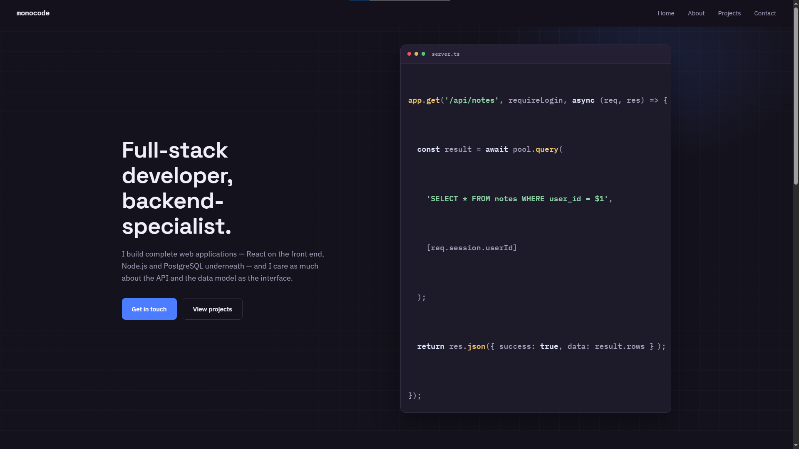

# monocode — Portfolio

Personal portfolio site, built with plain HTML, CSS, and JavaScript.

**🔗 Live site:** https://monocodeportfolio.vercel.app/

## Sections

- **Hero** — quick intro and a way to jump straight to contact or projects
- **About** — brief bio and a categorized tech stack
- **Projects** — my current highlighted projects, all with live links, source, and tech used
- **Contact** — LinkedIn, GitHub, Instagram, Fiverr, and a downloadable resume

## Stack

HTML, CSS, JavaScript — deployed on Vercel.